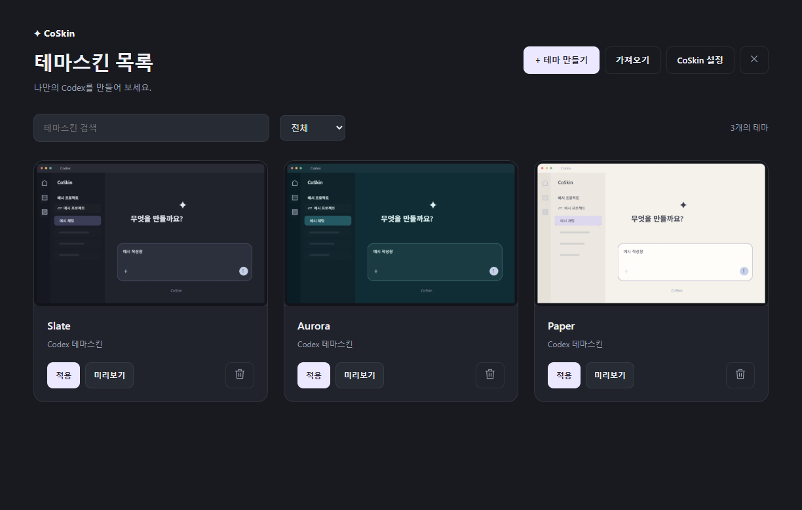

# CoSkin

**Make Codex your own.**

Style Codex with images, animated backgrounds and effects. Pick a theme, preview it in the actual app, and apply it with a click.

[한국어](README.md) · [English](README.en.md) · [日本語](README.ja.md) · [简体中文](README.zh-CN.md)

[Download for Windows](https://github.com/GNh0/CoSkin/releases/latest) · [Custom effects](docs/custom-effects.md) · [Compatibility](docs/support-matrix.md)

## Get started

1. Download the ZIP from the [latest release](https://github.com/GNh0/CoSkin/releases/latest) and extract it.
2. Run **CoSkin.Loader.exe** and choose your installation options.
3. Start Codex and CoSkin. **They connect automatically in either launch order.**

CoSkin waits in the tray if started first. Use the desktop **CoSkin** shortcut to start it independently, or **Codex + CoSkin** in the Start menu to launch both. No development tools are needed.

Currently supports **Windows x64 · Codex 26.924.2738.0**. Run both apps at the same Windows privilege level.

## What can you customize?

| Feature | What you can do |
| --- | --- |
| Theme library | Create, import and delete; preview and apply directly from cards |
| Details and editing | Edit theme information, duplicate, edit in the actual app and export |
| Images and GIFs | Set backgrounds, decorations and icons; adjust opacity separately from text |
| Animation effects | Configure hover, click and selected states, plus enter, exit and repeating effects |
| Application scope | Apply across the app, projects or chats; override individual items |
| Languages | Follow Codex in Korean, English, Japanese or Simplified Chinese |

## Choose and edit a theme

Open **CoSkin** from the left icon rail. Use **Preview** on a card to try a theme and **Apply** to use it. Click the card for details, editing, duplication and export.

| Theme library | Details and preview |
| :---: | :---: |
|  |  |

In editing mode, **right-click** the area you want to customize to adjust its images, effects and styles. Project and chat row edits apply to all rows of the same kind by default; choose an **individual override** to change just one item.

**Save** keeps your theme changes; **Apply** uses them in the selected scope. Cancel a preview to return to the previous theme. Add and share your own effects with the [custom effects guide](docs/custom-effects.md).

## Animated backgrounds and effects

Combine a GIF background with row hover effects to create your own theme.

View the effect editor and hover example

**Effect editor**

**Project row hover**

Screens show an unofficial Wuthering Waves Shorekeeper fan-art theme. [Image and GIF credits](docs/media/wuthering-waves/ASSET-NOTES.md)

## Startup and updates

Change themes or open **CoSkin settings** from the tray.

- **Start at Windows sign-in**: keep CoSkin ready to connect when Codex starts.
- **Exit with Codex**: close CoSkin when the last connected Codex exits.
- **Automatic updates**: download and install new stable GitHub releases. Manual checks are also available in settings.

If a GIF does not animate, check the motion option in effect settings and the Windows **reduced motion** preference. Large GIFs can affect scrolling performance.

## Learn more

[Development and build](docs/development.md) · [Custom effects](docs/custom-effects.md) · [Supported environments](docs/support-matrix.md) · [Publishing updates](docs/updates.md)

CoSkin source does not yet have an assigned license. See [third-party notices](THIRD-PARTY-NOTICES.txt) for dependency licenses.
