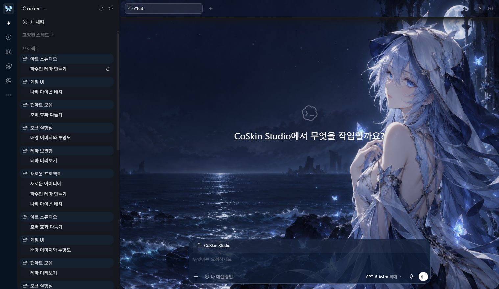
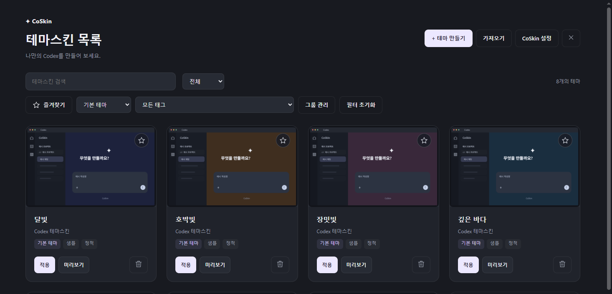
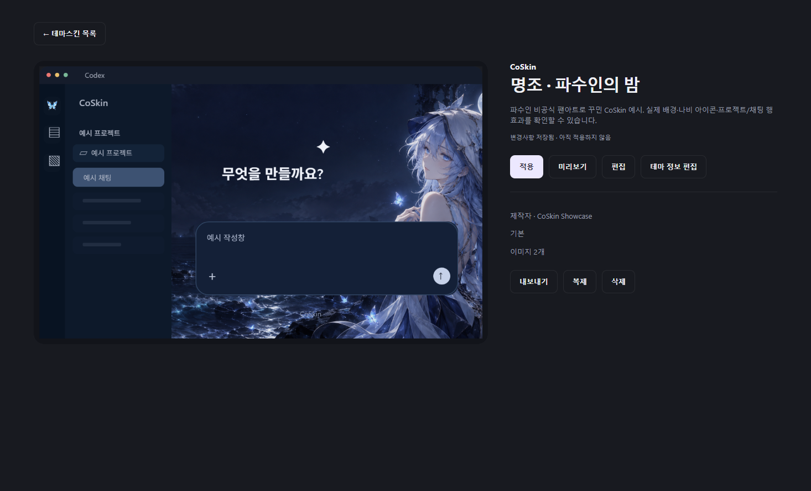
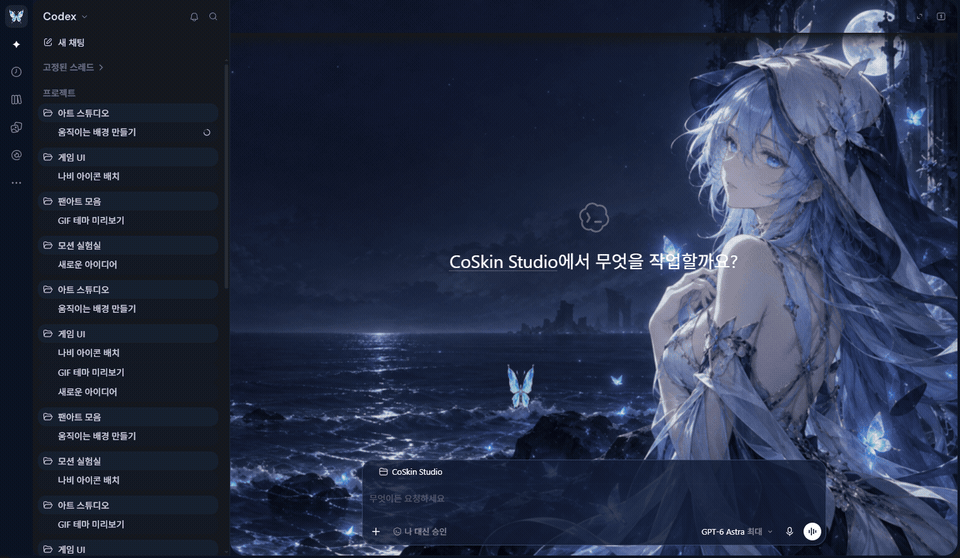
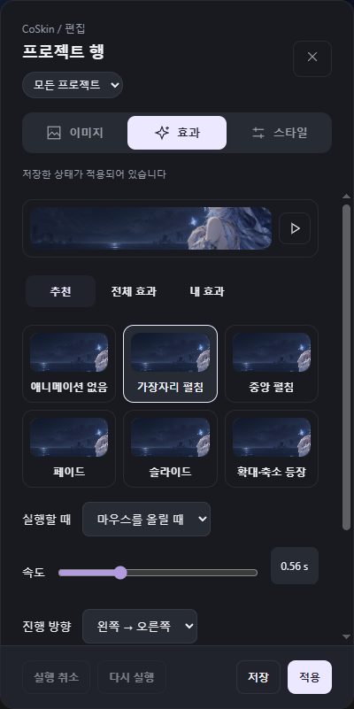
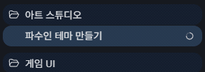

# CoSkin

**Codex를 나만의 공간으로.**

이미지와 움직이는 배경, 원하는 효과로 Codex를 꾸미세요. 테마를 고르고, 실제 화면에서 미리 본 뒤 바로 적용할 수 있습니다.

[한국어](README.md) · [English](README.en.md) · [日本語](README.ja.md) · [简体中文](README.zh-CN.md)

[Windows용 다운로드](https://github.com/GNh0/CoSkin/releases/latest) · [테마 제작·파일 사양](docs/theme-package-spec.md) · [테마 요청문](docs/theme-request-template.md) · [사용자 지정 효과](docs/custom-effects.md) · [호환성 안내](docs/support-matrix.md)

## 시작하기

1. [최신 릴리스](https://github.com/GNh0/CoSkin/releases/latest)에서 ZIP을 내려받아 압축을 풉니다.
2. **CoSkin.Loader.exe**를 실행하고 설치 옵션을 선택합니다.
3. Codex와 CoSkin을 실행합니다. **어느 쪽을 먼저 켜도 자동으로 연결됩니다.**

CoSkin을 먼저 켜면 트레이에서 Codex를 기다립니다. 바탕화면의 **CoSkin**으로 독립 실행하거나, 시작 메뉴의 **Codex + CoSkin**으로 함께 실행할 수 있습니다. 별도 개발 도구 설치는 필요 없습니다.

**Windows x64**에서 Codex와 CoSkin을 같은 Windows 권한으로 실행하세요. CoSkin 0.1.6부터는 Codex 버전 목록으로 연결을 막지 않고, 원본 서명과 실제 연결 기능을 확인합니다. 현재 Codex 26.928.2636.0에서 검증했습니다. 향후 내부 연결 기능이 바뀌면 CoSkin 업데이트가 필요할 수 있습니다.

## 무엇을 꾸밀 수 있나요?

| 기능            | 할 수 있는 일                                                             |
| --------------- | ------------------------------------------------------------------------- |
| 테마 라이브러리 | 만들기·가져오기·삭제, 카드에서 바로 미리보기·적용                         |
| 정리와 검색     | 중첩 폴더 트리·즐겨찾기·태그, 번호 페이지·정렬·다중 선택 정리             |
| 상세·편집       | 테마 정보 수정, 복제, 실제 화면 편집, 내보내기                            |
| 이미지·GIF·영상 | 배경·장식·아이콘 지정, 음소거 MP4 반복 재생, 영역별 권장 해상도·비율 안내 |
| 글자 스타일     | 테마에 맞춘 자동 글자색 또는 직접 지정한 색상·글꼴·굵기                   |
| 애니메이션 효과 | 호버·클릭·선택 상태와 진입·종료·반복 효과 설정                            |
| 적용 범위       | 앱 전체·프로젝트·채팅에 적용, 특정 항목만 개별 설정                       |
| 언어            | Codex 언어에 맞춰 한국어·영어·일본어·중국어 간체 표시                     |

## 테마 고르고 편집하기

왼쪽 아이콘 바에서 **CoSkin**을 열면 테마 목록이 표시됩니다. 카드의 **미리보기**로 확인하고 **적용**으로 바꾸세요. 카드를 클릭하면 상세 화면에서 편집·복제·내보내기를 할 수 있습니다.

AI에게 테마 제작을 맡기려면 [기본 요청문](docs/theme-request-template.md)과 [파일 사양·제작법](docs/theme-package-spec.md)을 함께 전달하세요. CoSkin 0.1.4부터는 목록의 **테마 요청문**에서 문구를 편집·복사할 수도 있습니다.

|                    테마 목록                     |                             상세·미리보기                             |
| :----------------------------------------------: | :-------------------------------------------------------------------: |
|  |  |

편집 모드에서는 꾸미려는 영역을 **우클릭**하세요. 이미지·효과·스타일을 조절할 수 있습니다. 프로젝트·채팅 행은 기본적으로 같은 종류의 모든 행에 적용하며, **개별 지정**으로 선택한 항목만 바꿀 수 있습니다.

**저장**은 테마 변경을 보관하고, **적용**은 선택한 범위에 반영합니다. 미리보기를 취소하면 이전 테마로 돌아갑니다. 직접 만든 효과는 [사용자 지정 효과 가이드](docs/custom-effects.md)를 따라 추가하고 공유할 수 있습니다.

목록은 왼쪽 폴더 트리와 오른쪽 폴더·테마 카드로 탐색합니다. 폴더는 한 번 눌러 선택하고 **더블 클릭 또는 Enter**로 열며, 테마를 누르면 기존 관리 화면이 열립니다. **폴더 보기/트리 보기**와 **미리보기 카드/한 줄 목록**을 각각 전환할 수 있습니다. 경로·뒤로·앞으로·상위 이동과 **하위 폴더 테마도 포함**을 지원하며, 테마 카드를 폴더로 드래그하면 분류만 이동합니다. 다중 선택 이동·즐겨찾기·태그 추가, 번호·처음·마지막·직접 페이지 이동과 24/48/96개 보기를 제공하며, 상세에서 돌아와도 검색과 목록 위치를 유지합니다. 한 줄 목록은 미디어 미리보기를 불러오지 않습니다. [목록 관리 안내](docs/theme-library.md)

상세 화면의 **글자색 자동 맞춤**은 글자 대비를 우선해 테마 색감을 약하게 반영합니다. 밝은 영상에서도 읽히도록 필요한 경우 글자 뒤 배경을 더 진하게 표시합니다. 편집 화면의 글자 스타일에서 **직접 지정**을 선택하면 색상·설치된 글꼴·굵기를 따로 정할 수 있습니다.

## 움직이는 배경과 효과

GIF 배경과 행 호버 효과를 조합해 나만의 테마를 만들어 보세요.

짧은 장면은 GIF, 긴 캐릭터 동작은 **MP4**로 넣을 수 있습니다. MP4는 음소거로 반복 재생하며, **효과 없음** 프로필에서는 정지 이미지로 표시합니다. 최소화했다 복원하면 재생 위치를 이어갑니다. 이미지 지정 화면에는 해당 영역의 권장 해상도와 비율이 표시됩니다. 전체 동작을 보려면 **전체 보이기**를 선택하세요.

효과 편집과 호버 예제 보기

**효과 편집**

**프로젝트 행 호버**

화면 예시는 명조 파수인 비공식 팬아트 테마입니다. [이미지·GIF 제작 정보](docs/media/wuthering-waves/ASSET-NOTES.md)

## 실행과 업데이트 설정

트레이에서 테마를 바꾸거나 **CoSkin 설정**을 열 수 있습니다.
배경의 어두운 레이어가 사라진 경우 트레이의 **테마 새로고침**을 누르면 현재 테마를 다시 그립니다.

- **Windows 로그인 시 시작**: CoSkin을 미리 켜 두고 Codex가 실행되면 연결합니다.
- **Codex 종료 시 함께 종료**: 마지막으로 연결된 Codex가 종료되면 CoSkin도 종료합니다.
- **자동 업데이트**: GitHub의 새 안정 버전을 받아 설치합니다. 설정에서 수동 확인도 가능합니다.

GIF가 움직이지 않으면 효과 설정의 움직임 옵션과 Windows의 **움직임 줄이기** 설정을 확인하세요. 큰 GIF는 스크롤 성능에 영향을 줄 수 있습니다.

## 더 알아보기

[개발·빌드](docs/development.md) · [사용자 지정 효과](docs/custom-effects.md) · [지원 환경](docs/support-matrix.md) · [업데이트 배포](docs/updates.md)

CoSkin 소스 라이선스는 아직 미지정입니다. 외부 구성요소의 라이선스는 [제3자 고지](THIRD-PARTY-NOTICES.txt)를 참고하세요.
