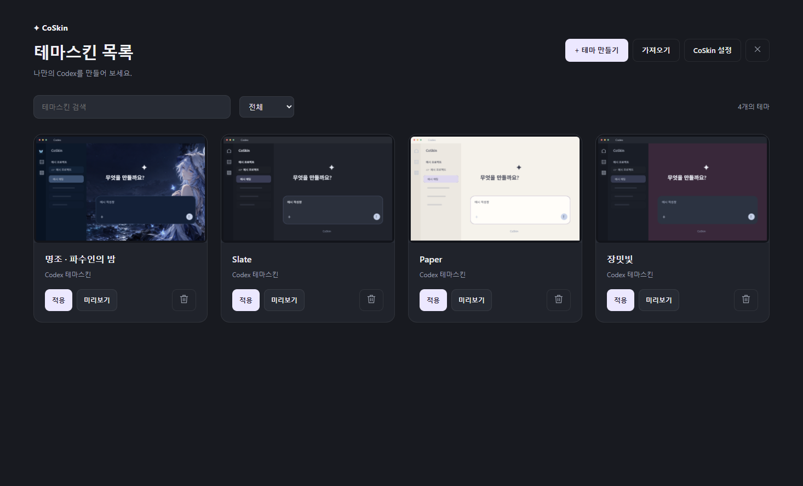

# CoSkin

[한국어](README.md) · [English](README.en.md) · [日本語](README.ja.md) · [简体中文](README.zh-CN.md)

Windows 扩展：从 Codex 左侧图标栏中的 **CoSkin** 打开内部管理的主题皮肤库，进行选择、预览、编辑和应用。

**0.1.0-beta.1为测试预发布版本**。这是非官方扩展，不代表正式产品已完成。

[下载 Windows x64 版本](https://github.com/GNh0/CoSkin/releases/tag/v0.1.0-beta.1) · [发布说明（韩语）](docs/release-0.1.0-beta.1.md)

## 安装与启动

解压Windows x64 ZIP，双击`CoSkin.Loader.exe`打开当前用户安装界面。请保留同一文件夹中的三个文件，无需另行安装Node或.NET。安装后从开始菜单的 **Codex + CoSkin** 启动。如果原版Codex正在运行，请保存工作并正常退出。CoSkin不会强制关闭它。

当前测试版使用已验证的专用快捷方式。暂不支持自动连接通过普通方式启动的原版Codex，也不支持在Windows登录时自动启动CoSkin。

联动启动和联动退出可分别选择。系统托盘提供主题应用、装饰开关、主题列表、设置和退出。通过Windows应用列表卸载，保留主题和素材。正在运行的安装文件残余清理仍待检查。

## 已知限制

- **使用大型GIF背景时，聊天滚动可能导致GIF暂停或卡顿。** 此测试版本发布后再改进。内置主题使用静态背景。
- 验证基准为Codex Windows包 **26.924.1866.0**、内部应用 **26.924.20706**。其他版本可能停止连接。
- 自动更新设置已提供，但正式签名密钥、发布版本及实际主机自动切换尚未准备好。目前请手动安装新版。
- 多窗口生命周期、新Windows用户安装、全部效果组合和最大主题包内存仍在验证。

## 实际应用示例

独立生成的鸣潮守岸人非官方同人示例，并非内置默认主题。不包含私人聊天或用户上传。[素材来源与生成说明](docs/media/wuthering-waves/ASSET-NOTES.md)。




动态图示例来自实际应用的间隔采样，不代表已验证流畅播放。请查看上述GIF滚动限制。

## 使用流程

直接在卡片上预览、应用或删除，或点击卡片主体打开独立的详情页面。进入编辑后会返回真实的 Codex 界面。仅在编辑模式下将目标的右键菜单替换为 CoSkin 设置，退出时恢复原菜单。保存和应用是两个独立操作。取消预览会保留先前的应用状态。

支持 PNG、JPEG 和动态 GIF。图片不透明度独立于原有文字和输入操作。减少动态效果、隐藏、最小化或移到显示器之外时会暂停动画。`.coskin` 用于导入和导出。导入的主题与资源存储在内部主题库中，即使外部原文件被删除也能继续使用。

## 实现和验证范围

验证副本已确认左侧栏右方完整专用页面、响应式卡片和详情、主题库操作、实际编辑及菜单恢复、PNG/JPEG/GIF解码与独立不透明度、GIF原始循环数、最小化及显示器外暂停和恢复，以及图片和主题包分块传输。自定义效果注册、播放和主题包往返、主题信息编辑、连续过渡、结果及文件树背景恢复和列表上方滚轮操作也已验证。最终视觉验收、多窗口、所有效果语义、最大包内存、普通启动、安装和文件关联尚未完成。请查看[实现状态](docs/support-matrix.md)。

界面优先跟随Codex应用语言，已实现韩语、英语、日语和简体中文的UI、无障碍及错误字典。中文地区变体回退为简体中文，其他不支持的语言回退为英语。通过临时改变文档lang已检查主题库、详情和编辑的切换及横向溢出；实际账户语言设置下的所有目标与错误路径仍未全面验证。

## 开发

使用 Node 24 LTS 和 .NET 10 LTS SDK。最终用户主机设计为无需 Node 即可运行。依赖使用精确版本和锁定文件。

```powershell
npm ci --ignore-scripts
npm test
node scripts/bundle.mjs
dotnet build src/CoSkin.Loader/CoSkin.Loader.csproj
dotnet run --project tests/CoSkin.HostTests/CoSkin.HostTests.csproj
```

请勿放宽执行策略。在脚本受限的环境中使用以上直接命令。不修改原始 Codex 可执行文件、ASAR 或完整性设置。

[产品设计](docs/CoSkin-설계서.md) · [包格式契约](docs/coskin-package-v1.md) · [架构与修改方法](docs/architecture.md)

个人环境的原始日志和截图不包含在公开发布中。在线图库和高级关键帧属于后续范围。


[自定义效果开发](docs/custom-effects.zh-CN.md)。已在验证副本确认注册、播放、主题包往返、主题信息编辑和连续悬停过渡；这不代表所有效果组合均已验证。

## 许可

CoSkin自身源代码许可尚未指定，授权范围仍待决定。第三方组件遵循各自许可。[第三方声明](THIRD-PARTY-NOTICES.txt)包含gifuct-js、parser及捆绑.NET运行时的完整许可和声明。示例同人媒体为独立生成内容，并非官方角色图片再发布。
