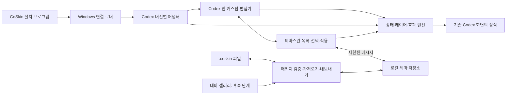

# CoSkin 제품·기술 설계서

문서 버전: 0.1 · 작성일: 2026-09-26 · 상태: 구현·실제 검수 진행 중

프로젝트: **CoSkin** · 저장소: `GNh0/CoSkin` · 테마 확장자: **`.coskin`**

이 문서는 사용자가 요청한 제품의 목표와 구현 기준을 정한다. 3절은 초기 연결 실험이며, 최신 구현·실제 시험의 범위는 [공개 검증 요약](support-matrix.md)을 기준으로 확인한다. 아래 목표·예산은 전체 제품의 검증 성능이나 출시 약속을 뜻하지 않는다. 개별 기능의 구현과 실제 검증을 구분한다. 개인 환경의 원시 검수 기록은 공개하지 않는다.

**제품의 중심은 프로그램이 관리하는 테마스킨 목록이다. 사용자는 목록에서 스킨을 선택해 적용한다. `.coskin`은 목록에 스킨을 가져오고 공유용으로 내보내는 교환 파일이다.**

## 1. 만들 제품

CoSkin은 Windows Codex에 연결하여 앱 화면의 디자인을 바꾸는 설치형 확장 프로그램이다. 설치 후에는 Codex 왼쪽 세로 아이콘 바의 **CoSkin** 버튼으로 **테마스킨 목록**을 연다. 목록에서 원하는 스킨을 선택해 적용하고, 편집을 누르면 실제 화면을 보며 해당 스킨을 수정한다.

사용자는 배경 이미지뿐 아니라 버튼 하나, 프로젝트 항목, 채팅 항목의 선택 배경, 마우스를 올렸을 때의 배경, 호버 정보 카드까지 각각 꾸밀 수 있어야 한다. 투명 배경과 애니메이션은 독립 설정으로 제공한다. 애니메이션을 꺼도 선택한 투명 배경과 이미지는 그대로 표시한다.

완성한 디자인은 프로그램의 테마스킨 목록에 저장한다. 공유할 때 이미지와 설정을 `.coskin` 파일로 내보내며, 받은 사람은 가져오기로 자신의 목록에 추가한다. 장기적으로는 앱 내부 테마 갤러리에서 검색·설치·업데이트까지 제공한다.

### 1.1 사용자와 합의한 방향

| 항목           | 확정된 방향                                                    |
| -------------- | -------------------------------------------------------------- |
| 제품과 저장소  | CoSkin / GNh0/CoSkin                                           |
| 사용 환경      | 기존 Windows Codex 앱과 기능을 유지하는 확장                   |
| 목록·편집 위치 | Codex 앱 내부. 왼쪽 세로 아이콘 바에 진입 버튼                 |
| 기본 적용 방식 | 프로그램의 테마스킨 목록에서 원하는 스킨 선택·적용             |
| 대상 선택      | 화면에서 꾸밀 항목을 직접 선택하고 즉시 미리보기               |
| 디자인         | 배경, 버튼별 아이콘·이미지, 선택·호버 배경, 투명도             |
| 효과           | 다양한 애니메이션과 조합, 상태별 지정, 애니메이션 없음         |
| 적용 범위      | 전체, 프로젝트, 개별 채팅                                      |
| 저장과 공유    | 내부 목록에 테마 저장·관리, 교환용 `.coskin` 가져오기·내보내기 |
| 배포 방향      | 별도 설치 구성요소. 향후 테마 공유·설치 갤러리                 |

### 1.2 구현 범위의 경계

첫 지원 플랫폼은 Windows이며, 실제 검증한 Codex 버전과 설치 경로 유형을 지원표에 명시한다. 다른 운영체제는 이 설계의 첫 배포 범위에 포함하지 않는다.

꾸미는 대상은 Codex가 렌더링하는 화면 요소다. Windows 기본 파일 선택 창, 운영체제 메뉴, 최소화·최대화·닫기 같은 네이티브 영역은 별도 지원 여부를 판단한다. 기존 버튼의 실행 기능, 대화 데이터, 모델 연결과 도구 실행 경로를 CoSkin에서 재구현하지 않는다.

## 2. 기능 요구사항

| ID  | 요구사항          | 완료를 판단할 동작                                                             |
| --- | ----------------- | ------------------------------------------------------------------------------ |
| R01 | 앱 내부 진입      | 왼쪽 아이콘 바에서 커스텀 버튼으로 테마스킨 목록을 열고 편집 화면으로 이동한다 |
| R02 | 직접 대상 선택    | 버튼·프로젝트·채팅 행·호버 카드를 식별하고 선택 위치를 표시한다                |
| R03 | 배경 편집         | 전체·사이드바·본문·입력창 등의 지원 영역에 이미지, 색상, 투명도를 지정한다     |
| R04 | 버튼별 아이콘     | 기존 아이콘 복원, 로컬 이미지 지정, 크기·여백·맞춤·상태별 이미지 설정          |
| R05 | 상태별 스타일     | 기본·선택·호버·선택+호버·키보드 포커스·누름·비활성을 구분한다                  |
| R06 | 정적인 투명 배경  | 효과 없음 상태에서 배경만 반투명하고 글자와 아이콘은 선명하다                  |
| R07 | 다양한 애니메이션 | 펼침·이동·등장·빛·아이콘 효과를 조합하고 매개변수를 조정한다                   |
| R08 | 적용 범위         | 전체 기본값 위에 프로젝트와 채팅 설정을 덮어쓴다                               |
| R09 | 테마스킨 목록     | 프로그램이 스킨을 보관하며 목록에서 선택·적용·편집·저장·복제·이름 변경·삭제    |
| R10 | 편집 복구         | 실행 취소·다시 실행·미리보기 취소·기본값 복원·초안 복구                        |
| R11 | 패키지 공유       | 이미지와 효과가 포함된 `.coskin` 파일을 내보내고 가져온다                      |
| R12 | 설치 파일 연결    | `.coskin` 더블클릭으로 가져오기 미리보기를 연다                                |
| R13 | 지속 적용         | 재실행·창 추가·화면 이동 후 지원 항목에 저장한 테마를 다시 적용한다            |
| R14 | 원래 기능 유지    | 탐색·검색·입력·전송·중단·메뉴·키보드 조작에 회귀가 없다                        |
| R15 | 지원 상태 표시    | 미지원 항목이나 업데이트로 찾지 못한 대상을 정확히 안내한다                    |
| R16 | 사용 중 해제      | 테마 효과를 즉시 끄고 Codex 기본 화면으로 복원한다                             |
| R17 | 공유 갤러리       | 검색·상세 보기·다운로드·설치·버전 선택·업데이트·제작자 게시                    |

R01~R16은 로컬 제품의 완성 범위다. R17은 온라인 서비스 단계로 분리하되, 처음부터 같은 `.coskin` 형식을 사용한다.

## 3. 검증 근거와 남은 불확실성

검증 환경: 2026-09-26, Windows Codex 패키지 26.924.1866.0 / 내부 앱 26.924.20706.

| 항목                       | 현재 근거                                            | 판단                                          |
| -------------------------- | ---------------------------------------------------- | --------------------------------------------- |
| 실제 앱 안 편집 패널       | 실제 `app://-/index.html`에 패널 삽입                | 확인                                          |
| 배경 이미지                | 앱 내부 파일 입력 이벤트와 PNG 반영 관찰             | 확인                                          |
| 기존 검색 버튼 이미지      | 원래 버튼 DOM·SVG·접근성 이름을 유지하며 이미지 변경 | 확인                                          |
| 원상복원                   | 편집기·스타일·대상 표식을 제거하고 배경 복원         | 확인                                          |
| 버튼 클릭·Enter·비활성     | 원본 버튼 컴포넌트의 격리 검사에서 확인              | 전체 실제 앱 기능 검증으로 확대 해석하지 않음 |
| 호버와 애니메이션          | 시험 코드에는 있으나 후속 검사 미완료                | 미검증                                        |
| 왼쪽 아이콘 바 진입        | 시험판은 우측의 임시 버튼 사용                       | 새 구현 필요                                  |
| 테마 보관함·범위·파일 교환 | 단일 대상 시험 설정만 존재                           | 새 구현 필요                                  |
| 일반 실행·재시작·업데이트  | 패키지 컨텍스트의 진단 실행으로만 실제 화면 연결     | 제품화의 선행 검증 과제                       |

초기 검증의 원시 기록은 개인 환경 정보가 포함되어 로컬에 보관한다. 공개 범위는 [검증 요약](support-matrix.md)에서 확인한다.

시험은 원본 실행 파일을 임시 위치에 복사하고 별도 Chromium 프로필로 실행했다. 앱은 기존 Codex 프로젝트·채팅 목록을 읽었으며, 백엔드까지 독립된 새 계정 환경은 아니었다. 임시 실행본과 프로필은 정리했다.

원본 ASAR의 무결성을 유지한 실행 후 화면 적용은 성공했지만, 일반 사용자 설치 경로는 아직 확정하지 않았다. Microsoft의 [Invoke-CommandInDesktopPackage 문서](https://learn.microsoft.com/en-us/powershell/module/appx/invoke-commandindesktoppackage?view=windowsserver2025-ps)는 패키지 컨텍스트 실행을 제공한다. 이 진단 경로의 성공만으로 평상시 Codex 실행과 같은 호환성을 보장하지 않는다.

## 4. 앱 안의 편집 화면

### 4.1 진입과 배치

왼쪽 세로 아이콘 바의 기존 버튼 순서를 유지하면서 **CoSkin** 버튼 하나를 추가한다. 툴팁과 접근성 이름은 `CoSkin · 커스텀`으로 제공한다. 앱의 활성 섹션 표시와 CoSkin 편집기 열림 표시는 구분한다.

버튼을 누르면 Codex 화면 안에 CoSkin 패널을 열고 **테마스킨 목록**을 먼저 보여 준다. 목록에서 편집을 선택하면 같은 패널이 편집 화면으로 전환되며 목록으로 돌아갈 수 있다. 패널 내부 스타일은 Shadow DOM 등으로 격리하여 Codex의 기본 스타일 때문에 체크박스나 입력창이 사라지는 일을 방지한다.

기본 패널 폭은 380px, 조절 범위는 320~560px로 제안한다. 좁은 창에서는 접을 수 있는 오버레이로 전환한다. 본문 폭을 줄이는 배치는 해당 버전의 레이아웃과 함께 검증한 경우에만 사용한다. 편집 중에도 작성창과 현재 대화로 돌아갈 수 있어야 한다.

패널이 테마 때문에 읽기 어려워지는 경우를 대비해 편집기 자체의 기본 외형과 **꾸미기 모두 끄기** 동작은 독립적으로 유지한다.

### 4.2 정보 구성

| 위치                   | 주요 조작                                                       |
| ---------------------- | --------------------------------------------------------------- |
| 상단                   | 현재 테마, 수정됨 표시, 적용 범위, 연결·지원 상태               |
| 테마스킨 목록: 첫 화면 | 기본·직접 제작·가져온 스킨, 미리보기 카드, 검색·필터, 선택·적용 |
| 선택한 스킨의 조작     | 편집, 새로 만들기, 복제, 이름 변경, 삭제, 가져오기·내보내기     |
| 대상                   | 화면에서 선택, 대상 목록, 선택 위치 강조, 대상별 초기화         |
| 스타일                 | 배경·이미지·아이콘·텍스트·테두리·그림자                         |
| 상태                   | 기본, 선택, 호버, 선택+호버, 포커스, 누름, 비활성               |
| 애니메이션             | 레이어별 효과 목록, 추가·삭제·순서, 시간·방향·반복              |
| 미리보기               | 실제 화면 반영, 상태 고정, 재생·일시정지·반복                   |
| 하단                   | 실행 취소·다시 실행, 저장, 적용, 미리보기 취소                  |
| 갤러리                 | 온라인 단계에서 테마 탐색·상세·설치                             |

목록의 카드에는 미리보기, 이름, 제작자, 현재 범위에서 적용 중인지, 호환 상태를 표시한다. 카드 선택은 상세 정보와 임시 미리보기를 보여 주며 **적용**을 눌렀을 때 선택 범위에 반영한다. 기본 제공 스킨과 기본 Codex로 복원하는 항목도 이 목록에서 접근할 수 있게 한다.

목록은 프로그램의 내부 저장소를 조회한다. 사용자가 가져온 원본 파일을 이동하거나 삭제해도 등록한 스킨·이미지·설정은 목록에 남아 있어야 한다.

### 4.3 실제 화면에서 대상 고르기

1. **화면에서 선택**을 누르면 편집 가능한 영역에 윤곽선을 표시한다.
2. 가리킨 항목을 `채팅 행 > 배경`, `검색 버튼 > 아이콘`처럼 사람이 읽을 수 있는 이름으로 안내한다.
3. 선택 모드에서만 클릭 한 번을 편집 대상 선택으로 사용한다. Esc 또는 선택 완료 시 즉시 평상시 입력으로 돌아간다.
4. 유효한 대상에 대해 종류, 개별 항목, 적용 범위를 보여 준다. 미지원 영역은 선택 가능하다고 표시하지 않는다.
5. 호버 카드처럼 일시적으로 나타나는 요소는 편집용 유지 모드나 대상 목록으로 다시 선택할 수 있게 한다.

프로젝트 이름·채팅 제목을 내부 식별자로 저장하지 않는다. 제목 변경이나 같은 이름의 채팅 때문에 다른 항목에 적용되는 일을 막는다. 안정적인 식별자를 얻을 수 없는 항목은 개별 저장을 비활성화하고 종류 전체 스타일만 제공한다.

### 4.4 대표 사용 흐름

**보관 중인 스킨 적용**: 커스텀 버튼 → 테마스킨 목록 → 원하는 카드 선택 → 전체/프로젝트/채팅 범위 선택 → 적용. 이후 다른 스킨으로 바꿀 때도 같은 목록에서 고른다.

**선택된 채팅에 정적인 투명 배경**: 채팅 행 선택 → 상태를 선택으로 지정 → 배경 색상과 투명도 조정 → 애니메이션 없음 → 저장·적용. 글자와 오른쪽 버튼의 투명도는 바뀌지 않는다.

**호버할 때 왼쪽에서 펼쳐지는 바**: 채팅 행 배경 선택 → 호버 상태 → 왼쪽에서 펼침 → 220ms, 감속 곡선 → 마우스가 나갈 때 반대로 접기. 선택된 채팅에서는 선택+호버 설정을 별도로 조정한다.

**버튼마다 다른 이미지**: 검색 버튼 아이콘 선택 → 이미지 지정 → 크기·여백 설정 → 호버 상태에서 별도 이미지나 아이콘 효과 지정. 홈·새 채팅 등은 각 버튼의 별도 설정으로 저장한다.

**다른 사용자의 테마 추가**: 목록의 가져오기 → `.coskin` 선택 → 이름·제작자·미리보기·호환성 확인 → 테마스킨 목록에 추가. 적용은 목록의 일반 선택·적용 동작으로 진행한다.

## 5. 꾸미는 대상과 상태

### 5.1 대상 목록

| 논리 대상            | 꾸미는 부분                                       | 식별·구현 주의점                           |
| -------------------- | ------------------------------------------------- | ------------------------------------------ |
| 앱 배경              | 이미지, 위치, 맞춤, 단색·그라데이션, 어둡게, 흐림 | 원본 표면을 가리는 하위 배경도 영역별 처리 |
| 왼쪽 아이콘 바       | 바 배경과 지원 버튼 각각의 아이콘·배경            | 기존 탐색·툴팁·접근성 이름 유지            |
| 프로젝트 행          | 폴더 아이콘, 글자, 배경, 펼침 표시                | 접기·펼치기 기능 유지                      |
| 채팅 행              | 선택·호버 배경, 제목, 선, 보조 버튼               | 고정·최근·프로젝트 목록의 같은 채팅 식별   |
| 호버 정보 카드       | 카드 배경·이미지·테두리·등장·퇴장                 | 실제 카드 노출 시점은 Codex가 결정         |
| 본문과 메시지        | 본문 배경, 지원 메시지 표면·타이포그래피          | 코드·링크·텍스트 선택 보존                 |
| 작성창과 도구 버튼   | 표면, 테두리, 개별 아이콘·호버 효과               | 입력 포커스·IME·전송·중단 상태 보존        |
| 대화 상단 도구       | 검색·추가·더보기 등 지원 버튼                     | 해당 앱 버전에 존재하는 항목만 목록에 표시 |
| 지원 팝오버·대화상자 | 배경·테두리·등장 효과                             | 포커스 가두기·Esc·닫힘 동작 유지           |

전체 목록을 제품 목표로 관리한다. 어댑터가 식별하고 회귀 검증한 항목부터 지원 목록에 추가하며, 첫 검색 버튼 검사만으로 모든 항목을 지원한다고 표시하지 않는다.

### 5.2 상태와 겹침

기본 상태를 바탕으로 활성 상태를 합성한다. 한 속성이 충돌하면 아래 순서에서 오른쪽 상태가 우선한다.

`기본 → 선택 → 호버 → 선택+호버 → 포커스 외형 → 누름 → 비활성`

포커스 외형은 가능한 한 독립된 링 레이어로 표현하고, 키보드 위치 표시를 제거하지 않는다. 비활성에서는 입력을 활성화하는 어떤 CoSkin 동작도 수행하지 않으며 동작 효과를 정지한다.

스타일이 지정되지 않은 속성은 상속한다. **상속**, **값 지정**, **명시적 제거**를 구분한다. 특히 애니메이션의 **없음**은 상위 범위에서 내려오는 애니메이션까지 끄는 값이며, 단순히 미설정한 상태와 다르다.

### 5.3 적용 범위

범위 우선순위는 `전체 → 프로젝트 → 개별 채팅`이다. 각 범위 안에서는 `대상 종류 전체 → 특정 항목` 순서로 덮어쓴다. 먼저 범위를 합성한 뒤 상태 우선순위로 최종 스타일을 결정한다.

- 사이드바의 각 행은 그 행이 가리키는 프로젝트·채팅 범위를 사용한다. 열려 있는 채팅의 설정을 모든 행에 퍼뜨리지 않는다.
- 본문·작성창·공통 도구 버튼은 현재 창에서 보고 있는 채팅의 범위를 사용한다.
- 홈·설정처럼 채팅이 없는 화면은 전체 범위로 돌아간다.
- 같은 채팅이 고정 목록과 프로젝트 목록에 함께 보이면 동일한 규칙을 적용한다.
- 각각의 Codex 창은 자기 활성 채팅에 맞는 디자인을 표시한다.
- 공유 테마에는 범용 디자인 프로필을 담고, 실제 프로젝트·채팅 ID의 연결은 PC의 로컬 설정에 둔다.
- 상위 범위로 되돌리기는 해당 덮어쓰기만 제거한다. 기본 Codex로 복원은 CoSkin 적용 전체를 해제한다.

## 6. 배경과 애니메이션 엔진

### 6.1 레이어

각 항목을 **배경, 이미지·장식, 테두리·빛, 아이콘, 텍스트**로 나누어 설정한다. 원래 요소 전체의 opacity를 낮추는 방식으로 투명 배경을 만들지 않는다.

예를 들어 채팅 행의 배경만 왼쪽에서 펼치고, 제목은 제자리에 둔 채, 아이콘만 살짝 회전할 수 있어야 한다. 원래 클릭 영역과 목록의 높이는 유지한다.

원본 자식 전체를 숨기는 시험 코드 방식은 제품에서 사용하지 않는다. 검증한 아이콘 노드만 시각적으로 대체하여 텍스트·배지·진행 표시·비활성 표시가 사라지지 않도록 한다. 아이콘 효과는 CoSkin이 소유한 이미지나 검증된 장식 레이어에 적용한다.

### 6.2 효과 목록

다음은 기본 제공할 효과 계열이다. 방향과 강도만 다른 항목을 독립 기능 수로 부풀리기보다 하나의 효과를 충분히 조절하도록 한다. 구현 완료 여부는 별도 효과 지원표로 관리한다.

| 계열        | 기본 효과                                                         | 조절 예                                       |
| ----------- | ----------------------------------------------------------------- | --------------------------------------------- |
| 정적        | 애니메이션 없음                                                   | 반투명 색상·이미지·테두리는 유지              |
| 펼침·마스크 | 가장자리에서 펼침, 중앙에서 양쪽 펼침, 위아래 펼침, 대각선 와이프 | 시작점, 축, 방향, 전환 폭                     |
| 이동        | 슬라이드, 살짝 들림, 밀려 들어오기                                | X/Y 거리, 복귀 방식                           |
| 크기        | 확대 등장, 축소 등장, 가벼운 바운스                               | 시작 비율, 강도, 탄성                         |
| 등장·흐림   | 페이드, 선명해지기, 이미지 교차 전환                              | 시작 투명도, 흐림 정도                        |
| 색과 빛     | 색상 전환, 그라데이션 이동, 빛 지나가기, 발광, 테두리 흐르기      | 색, 각도, 폭, 강도, 주기                      |
| 아이콘      | 기울기, 회전, 흔들림, 박동, 이미지 교체                           | 각도, 반복, 상태별 이미지                     |
| 상호작용    | 클릭 잔물결, 포인터 따라가는 은은한 빛                            | 반경, 중심, 반응 강도                         |
| 연속 선택   | 선택 표시가 이전 행에서 새 행으로 이동                            | 이동 시간, 교차 페이드, 행이 사라질 때의 대체 |
| 조합        | 펼침+페이드, 배경 펼침+아이콘 들림 등                             | 레이어별 시작 시점과 순서                     |

반복 발광·그라데이션 등은 사용자가 켠 경우에만 실행한다. 대량 목록에서는 화면에 보이는 항목만 동작한다. 무거운 흐림·빛·포인터 추적은 성능 검증 후 해당 버전의 지원 기능으로 등록한다.

### 6.3 공통 조절값

효과마다 적용 레이어, 시작 조건, 진입·퇴장, 재생 시간, 지연, 완급 곡선, 방향, 반복 횟수, 반복 간격, 강도, 이동 거리, 원점을 제공한다. 처음에는 일반 조절값만 보이고 세부 조합은 펼쳐서 편집한다.

시작 조건은 상태 진입·상태 해제·클릭·선택 변경·요소 표시를 구분한다. 클릭 효과는 기존 클릭을 관찰하며 원래 동작을 지연하거나 대체하지 않는다. 객체가 없어지면 퇴장 효과 때문에 DOM을 임의로 붙들어 두지 않는다.

효과 프리셋은 선언형 매개변수로 저장한다. 고급 편집에서는 허용된 속성의 키프레임·곡선을 추가할 수 있는 구조를 두되, 첫 버전은 지원 프리셋과 조합부터 구현한다.

### 6.4 실행 규칙

- 상태에서 최종 정적 외형을 먼저 계산하고, 애니메이션은 그 외형에 도달하는 과정으로 처리한다.
- 빠른 호버 진입·이탈 시 실행 중 효과를 취소·반전하거나 현재 위치부터 이어 간다. 효과를 계속 쌓지 않는다.
- 같은 레이어의 같은 속성을 두 효과가 동시에 제어하면 편집기에서 충돌을 표시한다. 분리 레이어 또는 순차 재생으로 해결하며 묵시적으로 덮어쓰지 않는다.
- 상태 변경마다 원래 색·이미지로 정확히 도달하도록 하고, 취소·저장·해제 후 임시 transform이나 opacity를 남기지 않는다.
- OS의 동작 줄이기 설정을 기본으로 존중하고, CoSkin 전체와 테마·항목별로 효과 없음도 제공한다.
- 애니메이션 없음과 동작 줄이기는 움직이는 GIF/WebP에도 적용한다. 정지 프레임을 표시하며 추출에 실패하면 정적 대체 이미지를 사용한다.
- 비활성 창·화면 밖 항목의 반복 효과와 포인터 추적을 중지한다.
- 폭·높이·주변 배치를 반복 변경하는 대신 CoSkin 장식 레이어의 변환·마스크·투명도를 우선 사용한다.

### 6.5 확장 방식

내부 Effect Registry가 효과 ID, 버전, 가능한 레이어, 매개변수 범위, 제어하는 속성과 성능 등급을 제공한다. 편집기는 이 정의로 설정 폼을 만든다.

새 효과는 CoSkin 코드 업데이트로 추가하고, 테마는 효과 ID와 값만 담는다. 지원되지 않는 필수 효과는 적용을 중단하며, 선택 효과는 어떤 부분이 생략되는지 미리보기에서 표시한다. 이 동작의 파일 규칙은 [패키지 명세](coskin-package-v1.md)에 정의한다.

## 7. 저장·적용·복구

### 7.1 테마와 적용 정보

테마는 이름과 버전이 있는 재사용 가능한 디자인 문서다. 적용 정보는 어떤 테마의 어떤 프로필을 전체·프로젝트·채팅에 연결했는지 나타내는 로컬 문서다. 하나의 테마를 여러 프로젝트에 적용할 수 있다.

테마 보관함은 사용자에게 **테마스킨 목록**으로 표시한다. 기본 제공, 직접 만든 테마, 파일에서 가져온 테마, 갤러리에서 설치한 테마를 모두 이 목록에서 관리하고 적용한다. 목록과 저장소가 프로그램의 기본 테마 관리 기능이다.

가져오기를 완료하면 해석한 설정과 필요한 자산을 내부 저장소에 복사·등록한다. 목록에서 적용할 때는 내부 ID와 리비전으로 이 데이터를 읽는다. 외부 `.coskin` 원본을 매번 열거나 그 경로를 따라가서 적용하지 않는다. 원본 패키지 보관은 복구를 위한 선택적 내부 기능이다.

내려받은 원본을 수정하면 우선 로컬 복제본을 만들어 갤러리 업데이트와 사용자의 수정을 구분한다. 같은 테마 ID·버전인데 내용 해시가 다르면 자동 덮어쓰지 않는다.

### 7.2 저장과 미리보기의 의미

| 동작               | 파일 변경                                              | 화면 반영                                   |
| ------------------ | ------------------------------------------------------ | ------------------------------------------- |
| 속성 편집          | 초안만 자동 기록                                       | 편집 중인 창에 임시 미리보기                |
| 저장               | 현재 테마의 새 로컬 리비전 기록                        | 적용 연결은 바꾸지 않음                     |
| 적용               | 현재 편집 내용을 저장하고 선택한 범위의 적용 연결 갱신 | 관련 창에 검증된 리비전 적용                |
| 다른 이름으로 저장 | 새 테마 ID를 가진 복제본 생성                          | 사용자가 적용하기 전에는 기존 연결 유지     |
| 미리보기 취소      | 저장하지 않은 편집을 취소                              | 마지막 적용 상태로 복귀                     |
| 상속으로 되돌리기  | 현재 범위의 덮어쓰기 제거                              | 상위 범위 스타일 사용                       |
| 꾸미기 모두 끄기   | 테마 파일을 보존하고 적용 활성화만 해제                | CoSkin 장식을 제거하고 Codex 기본 화면 복원 |

적용 연결은 테마의 특정 로컬 리비전을 가리킨다. **저장**만 했을 때 다른 창이나 프로젝트의 디자인이 몰래 바뀌지 않게 한다. 저장된 테마의 변경을 다른 연결에 반영하려면 적용 범위를 선택하여 **적용**한다.

수정 중 닫을 때는 저장·버리기·계속 편집을 선택할 수 있게 한다. 초안 자동 저장은 실시간 입력마다 파일을 쓰지 않고 짧게 모아서 처리한다. 새 실행에서는 복구 가능한 초안을 표시하되 이전의 정상 적용본을 우선 표시한다.

### 7.3 트랜잭션과 여러 창

1. 테마와 리소스를 검증하고 새 리비전을 임시 위치에 준비한다.
2. 현재 Codex 어댑터의 지원 범위로 적용 계획을 계산한다.
3. 창별로 준비 여부를 확인한 뒤 파일과 적용 연결을 원자적으로 교체한다.
4. 창이 적용 완료를 응답하면 성공 상태로 표시한다.
5. 일부 창에서 실패하면 성공한 창도 이전 리비전으로 복원한다. 응답할 수 없는 창은 복구 대기로 표시하고 재연결 때 이전 리비전과 동기화한다.

동시에 같은 테마를 편집한 창은 기본 리비전 번호를 비교하여 충돌을 감지한다. 다른 창의 변경을 조용히 덮어쓰지 않고 새 복제본 저장이나 새 리비전 불러오기를 제공한다.

프로세스가 중단돼도 마지막 정상 적용본과 초안을 별도로 보존한다. 현재 사용 중인 테마를 삭제하려면 해당 연결을 상속 또는 기본값으로 바꾼 후 보관함에서 제거한다.

## 8. 시스템 구성



### 8.1 모듈의 책임

| 구성요소             | 책임                                                                         |
| -------------------- | ---------------------------------------------------------------------------- |
| Windows 로더         | 설치된 Codex 탐색, 지원 버전 판단, 실행·재연결, 창별 세션과 복원             |
| Codex 어댑터         | 앱 버전에 맞는 대상 식별, 상태 관찰, 안정적인 프로젝트·채팅 ID 매핑          |
| 테마스킨 목록·편집기 | 내부 스킨 목록과 선택·적용, 대상·속성 편집, 상태 미리보기, 가져오기·내보내기 |
| 테마 코어            | 범위·상태 합성, 형식 검사, 이행, 리비전·적용 계획                            |
| 효과 엔진            | 선언형 효과를 CSS·Web Animations 등으로 실행, 취소·복원·성능 제어            |
| 저장소               | 테마·자산·초안·리비전·적용 연결을 사용자별로 저장                            |
| 패키지 모듈          | ZIP 처리, 파일·해시·형식 확인, 원자적 가져오기와 내보내기                    |
| 호환성 진단          | 지원 대상·실패 원인을 민감한 채팅 내용 없이 기록                             |

일반 Codex 플러그인은 보조 명령이나 도구 연결에 활용할 수 있다. 공개 문서에서 제공하는 스킬·MCP·도구 UI는 호스트 화면 전체를 바꾸는 API와 같지 않으므로, 핵심 화면 적용은 별도 로더·어댑터로 설계한다. 이는 [플러그인 구조](https://developers.openai.com/plugins/concepts/plugins)와 [MCP UI 설명](https://developers.openai.com/plugins/build/chatgpt-ui)을 바탕으로 한 설계 판단이다.

### 8.2 기술 선택 초안

- 편집기와 효과 엔진: TypeScript, 자체 번들한 UI. React 사용 시 CoSkin 소유의 루트에서만 마운트하고 Codex 내부 React 상태에 의존하지 않는다.
- Windows 호스트: 자체 실행 가능한 .NET 기반 소형 로더를 우선 검토한다. Codex의 런타임을 교체하지 않으며 사용자가 Node.js를 따로 설치하게 하지 않는다.
- 파일 저장: 사용자별 디렉터리의 JSON 문서와 자산 파일. 임시 파일·리비전·원자적 교체로 실패를 복구한다.
- 패키지 처리: 검증된 ZIP 라이브러리와 공통 JSON Schema. 구체적인 버전은 구현 시작 시 현재 지원 상태를 확인해 고정한다.
- 연결 전송: 실제로 검증한 로컬 렌더러 연결을 출발점으로 사용한다. 배포 가능한 실행 경로의 선택은 9절의 선행 검증 결과로 확정한다.

서로 다른 언어에서 읽는 JSON 계약에는 동일한 샘플과 정상·오류 픽스처를 사용한다. 레이어·효과의 의미는 렌더러 엔진 한 곳에서 계산하고, 호스트는 파일과 권한 경계를 담당한다.

### 8.3 호스트와 편집기의 통신

편집기가 호출하는 동작은 테마 목록·읽기·저장·가져오기·내보내기·적용·해제로 제한한다. 메시지에는 세션 ID, 요청 ID, 창 ID, 계약 버전, 기본 리비전을 넣는다. 파일 경로를 임의 실행 명령으로 넘기는 API는 만들지 않는다.

로컬 IPC는 현재 사용자와 검증된 CoSkin 세션만 사용하도록 한다. 개발용 디버깅 연결 자체의 접근 제어 한계는 별도로 평가한다. CoSkin의 IPC 인증만으로 Codex 디버깅 포트가 보호된다고 판단하지 않는다.

호스트가 끊겼을 때 렌더러에 남은 CSS가 자동으로 사라진다고 가정하지 않는다. 렌더러 측 연결 감시와 정리 루틴을 두고, 일정 시간 복구되지 않으면 장식을 제거한다. 정상 종료는 정리 확인 후 연결을 끊는다.

## 9. Codex 연결과 호환성

### 9.1 배포 연결의 선행 검증

현재의 `integration/prepare.mjs`는 특정 설치본과 임시 복사 경로를 사용하는 실험용이다. 이 스크립트를 그대로 사용자의 설치 프로그램으로 배포하지 않는다.

제품의 우선 목표는 사용자의 Codex 설치를 찾아 지원되는 실행 경로로 연결하고, 저장된 테마를 적용하는 것이다. 다음을 선행 검증한다.

| 시나리오                   | 필요한 확인                                                      |
| -------------------------- | ---------------------------------------------------------------- |
| CoSkin으로 Codex 실행      | 원래 로그인·프로젝트·앱 업데이트 동작을 유지하며 화면 연결       |
| 이미 실행 중인 Codex       | 검증된 연결 대상이 있는 경우에만 붙기. 없으면 필요한 재실행 안내 |
| 일반 Codex 바로가기 실행   | 자동 연결이 가능한지 별도로 검증하고 실제 결과를 지원표에 기재   |
| 창을 새로 열거나 다시 로드 | 창 식별과 중복 삽입 방지, 동일 규칙 재적용                       |
| Codex 업데이트             | 새 실행 파일과 어댑터 확인, 미지원이면 기본 화면으로 사용        |
| CoSkin 종료·장애           | 주입한 장식·이벤트·자원을 제거하거나 감시 루틴으로 해제          |

일반 실행에 자동 연결하지 못한다면 첫 시험판은 **CoSkin으로 실행** 경로를 명확히 표시한다. 일반 실행까지 지원한다고 홍보하지 않는다. 정상 실행 중인 Codex를 자동으로 종료하거나 원래 사용자 프로필을 다른 프로필로 바꾸지 않는다.

원본 설치 파일을 수정하지 않는 경로를 우선한다. 무결성 검사를 끄거나 WindowsApps 권한을 바꾸는 것을 배포 방식으로 삼지 않는다. 복사 실행이 불가피한 후보는 앱 업데이트·계정·패키지 정체성 문제까지 검증한 뒤 채택 여부를 판단한다.

### 9.2 화면 어댑터 계약

어댑터는 `discoverTargets`, `resolveContext`, `observeState`, `mountDecoration`, `dispose`에 해당하는 역할을 제공한다. 공개된 안정적 계약이 없는 내부 연결부라는 점을 전제로 한다.

- 논리 ID 예: `navigation.search`, `sidebar.thread-row`, `sidebar.thread-preview`, `composer.send`.
- 저장 테마에는 임의 CSS 선택자·번들 파일명·번역된 버튼 이름을 넣지 않는다.
- 가능한 안정적 속성·역할·구조의 조합으로 찾고, 후보 개수·형태를 검증한다. 역할 이름 하나만으로 확정하지 않는다.
- 대상이 여러 개로 모호하거나 구조가 달라지면 해당 규칙 적용을 보류한다.
- 가상 목록에서 DOM이 다른 채팅에 재사용될 때 기존 표식·효과를 제거하고 새 ID에 연결한다.
- 화면 이동이나 번역 언어 변경 시 다시 식별한다. 제목 문자열이나 React 비공개 내부 객체에 기대지 않는다.
- 상태는 Codex의 실제 선택·호버·비활성 상태를 관찰한다. CoSkin이 대화의 선택 상태를 대신 관리하지 않는다.

### 9.3 호환성 표

지원표는 Codex 표시 버전, 패키지 버전, 실행 파일 서명·경로 유형, 어댑터 버전, 지원 대상·효과, 실제 실행 시나리오를 기록한다. 테마 엔진 호환성과 Codex 앱 호환성을 별도 판단한다.

CoSkin 업데이트와 어댑터 업데이트는 검증된 릴리스 단위로 배포한다. 테마 파일에서 연결 코드나 어댑터를 내려받아 실행하지 않는다. 알 수 없는 앱 버전에서는 화면 적용을 해제하고 보관함 데이터는 유지한다.

## 10. .coskin 가져오기·내보내기

`.coskin`은 ZIP 기반 패키지로 정한다. 이름은 CoSkin 테마임을 알아보기 위한 것이며, 실제 형식은 내부 식별자·버전·문서 검사로 판단한다. 상세 계약과 예시는 [.coskin 파일 형식 v1 초안](coskin-package-v1.md)에 둔다.

패키지에는 테마 정보, 프로필별 대상·상태·효과, 배경·아이콘 이미지, 선택적 미리보기를 포함한다. 상대 경로와 자산 참조를 사용하여 다른 PC에서도 같은 디자인을 해석하도록 한다.

**기본 적용 동작은 테마스킨 목록의 선택·적용**이다. 가져오기는 검증된 테마를 그 목록에 추가하는 보조 동작이다. 적용은 목록의 스킨을 사용자가 고른 전체·프로젝트·채팅 범위에 연결한다. 파일을 더블클릭하거나 내려받았다는 이유만으로 현재 화면을 교체하지 않는다.

내보내기는 현재 선택한 테마 또는 편집 범위의 유효한 디자인을 하나의 프로필로 합친 복제본을 생성한다. 특정 프로젝트에서 사용하던 모습도 그 프로젝트의 경로·ID 없이 공유할 수 있다.

원래 PC의 절대 파일 경로, 실제 채팅 ID·제목, 로그인 정보는 테마에 필요하지 않다. 미리보기는 합성 프로젝트명과 예시 채팅으로 만드는 것을 기본으로 한다. 사용자가 직접 넣은 이미지 안의 개인 정보까지 자동으로 제거된다고 보장하지 않는다.

## 11. 배포와 사용자 데이터

### 11.1 설치 프로그램

설치 프로그램은 CoSkin 로더, 편집기 번들, 기본 테마, 검증한 어댑터를 설치한다. Codex 본체 바이너리를 포함하지 않는다. 사용자 범위 설치를 기본으로 검토하고, 필요한 권한은 선택한 실행·패키징 경로의 실제 검증 결과로 정한다.

설치 UI는 Codex 탐색 결과와 지원 여부를 보여 준다. 자동 시작은 별도 선택으로 제공한다. `.coskin` 파일 연결은 등록 가능하도록 만들되 기존 기본 앱을 강제로 바꾸지 않고 Windows의 선택 절차를 따른다.

실행 연동은 `Codex + CoSkin` 전용 바로가기를 기준으로 한다. 설치 및 이후 설정에서 함께 실행/마지막 대상 종료 시 함께 종료를 독립적으로 선택한다. 원래 Codex 바로가기를 바꾸거나 원본 프로세스 종료를 강제하지 않는다. 시스템 트레이에서 테마 선택·적용, 꾸미기 켜기/끄기, 목록·설정 열기, 직접 종료와 실행 옵션 변경을 제공한다. 여러 창의 편집/미리보기 상태를 보호하며 종료 시 사용자 초안을 보존한다.

CoSkin 자동 업데이트는 독립적인 켜기/끄기 옵션이다. 상위 안정 버전의 서명·SHA256·다운로드/압축 경계를 검증한 뒤 임시 준비, 협조적인 호스트 전환과 준비 응답 확인, 실패 시 이전 배포 복구를 거친다. 편집/미리보기/진행 중 작업에서는 전환을 미룬다. Codex 원본이나 사용자 테마 업데이트와 혼동하지 않는다. 공개 키/릴리스가 없으면 업데이트를 사용 가능 또는 검증 완료로 표시하지 않는다.

업데이트는 CoSkin 코드·어댑터와 테마 콘텐츠를 구분한다. 설치 실패 시 이전 CoSkin 버전과 사용자 테마를 보존한다. 제거 시 CoSkin 프로세스·파일 연결·자동 시작 항목을 정리하고, 사용자 테마 삭제는 별도 선택으로 둔다.

### 11.2 저장 위치 제안

```text
%LOCALAPPDATA%/CoSkin/
  settings.json
  library/                 테마별 불변 리비전과 원본 패키지
  assets/                  해시로 식별한 이미지와 정적 대체 이미지
  bindings.json            전체·프로젝트·채팅의 로컬 적용 연결
  drafts/                  저장 전 편집 초안
  recovery/                마지막 정상 적용 정보
  compatibility/           설치본·어댑터 검증 결과
  logs/                    제한된 진단 정보
```

테마가 삭제돼도 다른 테마가 사용하는 공용 자산은 지우지 않는다. 데이터 이행 전에 복구본을 보존하고 실패하면 이전 형식을 사용한다.

### 11.3 소스 공개 준비

공개 소스는 사용자가 지정한 GNh0/CoSkin을 대상으로 한다. 라이선스는 아직 선택하지 않았으며 임의로 부여하지 않는다. 코드 공개 전에 라이선스·의존성 고지와 배포 이미지의 사용 권한을 정한다.

현재 실험 캡처와 일부 로그에는 실제 프로젝트·채팅 제목, 사용자 경로, 실행 환경이 들어 있다. 원본 증거는 로컬에 보존하고 공개 예제는 합성 데이터로 다시 만든다. Git 공개 이력에 넣기 전에 공개용 파일 목록을 확인한다.

이 문서 작성은 로컬 설계 작업이며 저장소 게시나 릴리스 생성을 완료했다는 의미가 아니다.

## 12. 테마 갤러리

프로그램의 테마스킨 목록·편집·저장·적용만으로 로컬 사용은 완결되게 한다. 파일 가져오기·내보내기로 스킨을 교환하고, 갤러리는 같은 패키지 위에 검색·발견·업데이트 기능을 추가한다.

갤러리 화면에는 미리보기, 이름·제작자·설명, 태그, 지원 CoSkin 버전, 필수 효과, 파일 크기, 버전 목록을 표시한다. 설치는 기존 패키지 검증을 거쳐 내부 테마스킨 목록에 추가한다. 적용은 목록에서 수행하며, 업데이트도 새 버전을 미리 본 후 적용할 수 있게 한다.

첫 온라인 단계는 검토된 정적 카탈로그와 다운로드로 시작할 수 있다. 사용자 직접 게시 단계에서는 작성자 인증·소유권, 불변 버전·파일 해시, 신고·게시 철회, 저장소와 대역폭 운영을 추가한다. 댓글·평점·동기화는 별도 후속 범위로 둔다.

로그인은 온라인 게시 등에 필요한 시점에만 요구한다. 로컬 편집·가져오기·내보내기에는 온라인 계정을 요구하지 않는다.

## 13. 품질 기준

### 13.1 기능과 접근성

CoSkin이 소유한 스타일·표식·리스너·애니메이션·객체 URL을 추적하여 전부 정리할 수 있어야 한다. 원래 클릭 영역, 키보드 접근, accessible name, 포커스·비활성 의미를 보존한다.

상태 고정 미리보기는 CoSkin의 시각 상태만 바꾼다. Codex의 실제 선택·전송 상태를 바꾸지 않는다. 표시용 장식은 포인터 입력을 가로채지 않으며 편집 모드에서만 대상 선택을 위해 입력을 사용한다.

### 13.2 성능 목표

아래 수치는 개발 검증 목표다. 하드웨어·디스플레이·Codex 버전·사용 테마를 기록한 뒤 달성 여부를 공개한다.

| 상황           | 제안 목표                                                                    |
| -------------- | ---------------------------------------------------------------------------- |
| 정적 테마 유휴 | 지속적인 프레임 루프 없음. 관찰자는 필요한 변경만 처리                       |
| 화면 상호작용  | 60Hz 기준 CoSkin 처리 p95 4ms 이하를 목표로 측정                             |
| 많은 목록      | 합성 채팅 1,000개와 화면에 보이는 약 50개 행에서 가상화 유지                 |
| 추가 메모리    | 정적·일반 효과 기준 CoSkin 증가분 150MiB 이하 목표. 자산 포함 측정           |
| 반복 사용      | 테마 교체·패널 열기·닫기 100회 후 노드·리스너·자산 참조 증가가 누적되지 않음 |

기준 Codex와 같은 조건에서 입력 반응·스크롤·메모리를 비교한다. 코어 효과가 기준을 넘으면 자동 품질 낮춤이나 해당 효과의 지원 제한을 제시한다. 추측으로 호환성이나 성능을 통과 처리하지 않는다.

### 13.3 검증 항목

| 검사          | 포함할 사례                                                                               | 연결 요구사항     |
| ------------- | ----------------------------------------------------------------------------------------- | ----------------- |
| 실제 앱 통합  | 왼쪽 진입→목록→선택·적용, 여러 버튼 이미지, 배경 적용·해제                                | R01~R04, R09, R16 |
| 상태와 투명도 | 선택·호버·동시 상태·키보드·비활성, 효과 없음                                              | R05~R07           |
| 효과 전환     | 빠른 왕복 호버, 중간 취소, 퇴장, 조합 충돌, 정적 대체                                     | R07               |
| 범위          | 제목 변경, 중복 노출, 다른 프로젝트·창, 행 재사용                                         | R02, R08, R13     |
| 편집과 복구   | 저장과 적용 구분, 충돌 편집, 저장 도중 종료, 초안 복구                                    | R09~R10           |
| 목록·패키지   | 왕복 내보내기, 자산 해시 일치, 원본 파일 삭제 후에도 목록 유지·적용, 다른 PC에서 가져오기 | R09, R11          |
| 파일 연결     | Codex 열림·닫힘 상태의 더블클릭, 잘못된 파일                                              | R12               |
| 재연결        | 지원 실행 경로, 창 재생성, 앱 업데이트·연결 중단                                          | R13, R15~R16      |
| 기존 기능     | 탐색·검색·IME 입력·전송·중단·메뉴·키보드·텍스트 선택                                      | R14               |
| 파일 검증     | 잘못된 ZIP·경로·크기·이미지·형식·버전·효과·중복 자산                                      | R11, R15          |
| 갤러리        | 검색·설치·실패 복구·버전 갱신·게시·철회                                                   | R17               |

내보내기 왕복은 표시 결과뿐 아니라 정규화된 설정과 자산 해시를 비교한다. 렌더러 검사는 모형 화면만으로 끝내지 않고 지원한다고 표시할 실제 Codex 설치본에서 수행한다.

## 14. 구현 순서와 완료 조건

| 단계                | 결과물                                                                    | 다음 단계로 가는 기준                                                       |
| ------------------- | ------------------------------------------------------------------------- | --------------------------------------------------------------------------- |
| P0 연결 제품화 조사 | 설치본 탐색, 실행 방식, 세션·창 식별, 기본 복원                           | 지원할 실제 실행 시나리오와 실패 조건을 재현·문서화                         |
| P1 목록·기본 편집기 | 왼쪽 버튼, 내부 스킨 목록과 선택·적용, 대상·레이어·상태·정적 스타일, 저장 | 목록의 스킨을 배경·검색 등 지원 버튼·채팅 행에 실제 적용하고 입력 기능 유지 |
| P2 로컬 테마 제품   | 범위·리비전·보관함, .coskin, 효과 레지스트리·기본 카탈로그                | R01~R11·R13~R16의 지원표와 실제 앱 검증 통과                                |
| P3 설치 배포        | 설치·업데이트·제거·파일 연결, 복구·진단                                   | R12 포함 로컬 제품 기준 통과, 새 Windows 사용자 환경에서 재현               |
| P4 공유 갤러리      | 앱 내부 카탈로그·설치·업데이트, 이후 사용자 게시                          | R17과 패키지 검증·버전 관리·게시 운영 기준 통과                             |
| P5 효과 확장        | 고급 키프레임, 추가 레이어·효과·지원 플랫폼 검토                          | 기존 형식의 호환성·성능·회귀 검증 유지                                      |

P1은 확인용 중간 단계다. 사용자가 요청한 다양한 효과·상태·테마 저장·파일 교환이 없는 P1을 완성품으로 취급하지 않는다. P2에서는 6.2의 효과 계열별 구현·지원 결과를 공개하고, 미완성 항목은 명시적으로 다음 버전에 배치한다.

## 15. 아직 결정해야 할 항목

| 항목                         | 현재 제안 또는 판단 방법                            | 결정 시점  |
| ---------------------------- | --------------------------------------------------- | ---------- |
| 배포 실행·연결 방식          | 실제 설치본에서 자동 연결 가능 범위를 조사하고 선택 | P0         |
| 첫 지원 Codex 버전·설치 유형 | 기존 검증 버전부터 지원표를 만들고 확장             | P0         |
| 설치 도구·정확한 런타임 버전 | 연결 방식과 배포 크기·권한 검증 후 고정             | P0~P1      |
| 라이선스                     | 사용자 선택 필요. 소스·테마 자산의 라이선스는 구분  | 공개 전    |
| 갤러리 호스팅·게시 인증      | 로컬 제품 후 비용·운영 범위에 맞게 선택             | P4 시작 전 |
| 고급 효과의 첫 출시 범위     | 기본 카탈로그의 실제 성능과 호환성 결과로 결정      | P2         |

이 항목들은 현재 설계서 작성을 막지 않는다. 각 결정 시점에 선택 근거와 검증 결과를 기록한다.

## 16. 설계 산출물과 참고

- [테마 파일 계약](coskin-package-v1.md)
- [프로젝트 소개](../README.md)
- [공개 검증 범위](support-matrix.md)
- [구조와 변경 방법](architecture.md)

다음 구현 작업의 첫 결과물은 P0의 **지원 실행 경로와 복원 가능성을 확인한 연결 모듈**이다. 이후 그 연결 위에 왼쪽 CoSkin 버튼, 테마스킨 목록과 선택·적용, 상태·레이어 편집기를 올린다.

## 17. 구현 중 확정한 사용자 화면·미디어 계약

이 절은 사용자 교정을 반영한 구현 기준이며 완료 선언이 아니다. 항목별 실제 검수 상태는 [구현 상태표](support-matrix.md)를 따른다.

- CoSkin 진입 시 주 아이콘 바만 남기고 그 오른쪽 전체가 CoSkin 페이지로 전환된다. 큰 정적 미리보기 카드를 반응형 격자로 표시하고 검색·추가·가져오기를 제공한다. 카드 본문은 별도 상세 페이지로 이동하고, 목록에서도 미리보기·적용·삭제를 직접 실행할 수 있다.
- 상세 페이지에서 임시 미리보기·편집·적용·삭제를 구분한다. 미리보기와 편집은 실제 Codex 화면으로 돌아오며, 편집 중에만 원래 우클릭 메뉴 대신 해당 대상의 이미지·효과·스타일 편집을 연다. 종료하면 원래 메뉴·레이아웃·입력·포커스를 복원한다. 임시모드 제어는 입력을 가리는 떠 있는 바가 아니라 예약한 상단 공간에 표시한다.
- 프로젝트·채팅 행을 우클릭하면 기본은 모든 프로젝트/모든 채팅을 꾸미는 설정이다. 개별 지정은 선택한 안정 ID의 예외를 만든다. 기존 개별 설정은 보존하고 사용자 명시 동작으로만 전체 규칙에 옮긴다. 전체로 옮긴 현재 상태의 같은 대상 예외는 지워 이후 전체 편집을 가리지 않게 하며, 다른 상태·다른 대상은 보존한다.
- PNG·JPEG·움직이는 GIF를 배경과 버튼 이미지에 사용한다. 이미지 레이어 불투명도는 원래 글자·기능의 불투명도와 분리된다. GIF 재생/대표 프레임과 UI 전환 효과 없음은 별도 옵션이다. 목록·상세 대표 미리보기는 정적 합성 이미지이며 실제 채팅 내용은 읽거나 내보내지 않는다.
- 움직임은 앱별 시스템 따르기/CoSkin 허용/모두 정지로 저장한다. CoSkin 허용은 Windows 설정을 바꾸지 않고 CoSkin의 감소 모션 처리만 명시적으로 재정의한다. 최소화·화면 밖·창별 native 가시성 정지는 허용 정책에서도 유지한다. 정지 이유와 허용 동작을 화면에 표시한다.
- UI는 Codex의 실제 html.lang을 우선하며 한국어·영어·일본어·중국어 간체를 지원한다. 중국어 지역 값은 간체로, 그 밖의 미지원 언어는 영어로 대체한다. 앱의 밝은/어두운 테마를 상속한다. UI 언어와 움직임 정책을 공유 테마 데이터에 넣지 않는다.
- 작은 전송 조각·해시 기반 자산·공유 디코딩·가시성 정지·참조 해제를 사용한다. 정적 유휴에서 반복 전체 화면 탐색이나 전 프레임 GIF→DataURL 변환을 하지 않는다. 성능 목표는 실제 동일 조건 측정 후 판정하며 특정 검수 시점의 메모리 수치로 전체 목표 통과를 단정하지 않는다.
